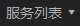

# 向备份策略中绑定服务器

创建备份策略后，通过向备份策略中绑定服务器给备份策略关联服务器。

## 前提条件

-   已创建至少1个备份策略。
-   至少存在一个状态为“运行中”或“关机”的服务器。
-   一个备份策略中最多可以绑定64个服务器。

## 操作步骤

1.  登录云服务器备份管理控制台。
    1.  登录管理控制台。
    2.  单击，选择“存储 \> 云服务器备份”。

2.  选择“策略“页签。
3.  在需要绑定服务器的备份策略所在行单击“绑定服务器“，如[图1](#fig10591125610163)。

    **图 1**  绑定服务器  
    

4.  在服务器列表中勾选需要绑定的服务器，勾选后将在已选服务器区域展示。

    > **说明：**   
    >-   一个备份策略中最多可以绑定64个服务器。  
    >-   如果选择的服务器已经绑定到其他备份策略，在选择新的备份策略后，服务器会自动从原备份策略解绑，并绑定到新的备份策略。  
    >-   如果服务器中有云硬盘已经加入云硬盘备份策略中，建议在云硬盘备份服务的备份策略中移除该服务器的云硬盘，否则云硬盘将产生两个备份。  
    >-   支持绑定服务器中的共享云硬盘。  
    >-   只能选择状态为“运行中”或“关机”的服务器。  

5.  单击“确定”。

