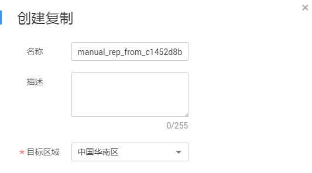

# 复制备份（跨区域）

CSBS的跨区域复制能力支持将已生成的备份复制到另一个区域。后续可在另一个区域使用复制的备份数据创建镜像，并发放新的云服务器。

在控制台上共支持如下三种复制方式：

-   在备份列表选择某一个备份，手动执行一次复制。
-   在备份策略中配置复制策略，周期性的对策略产生的未向目标区域进行过复制或复制失败的备份执行复制操作。
-   选中某个备份策略，手动执行复制操作，立即对策略产生的未向目标区域进行过复制或复制失败的备份执行复制操作。

本节主要介绍第一种复制方式。对于第二种方式的介绍请参见[创建备份策略](创建备份策略.md)，对于第三种方式的介绍请参见[立即执行复制策略](立即执行复制策略.md)。

> **说明：**   
>下述的约束与限制对三种复制方式均适用。  

## 约束与限制

-   同时满足以下条件的备份才能执行创建复制操作：
    1.  备份由弹性云服务器产生。
    2.  备份数据包含系统盘。
    3.  备份状态为“可用”。

-   仅支持对本区域生成的备份执行复制操作，不支持对复制而来的备份执行复制操作，从其他区域复制而来的备份仅可用于创建镜像。
-   一个源备份可以分别复制到不同的目标区域，一个目标区域只能同时存在该源备份的一个目标备份。向一个目标区域复制的次数在不同的复制方式下有所不同：
    -   对单个备份手动创建复制：在目标区域将目标备份删除后可再次复制。
    -   通过策略复制：每个目标区域仅能复制一次，即使将目标备份删除后也不允许再次复制。

-   仅支持向具备复制能力的目标区域复制备份数据。

## 操作步骤

1.  登录云服务器备份管理控制台。
    1.  登录管理控制台。
    2.  单击，选择“存储 \> 云服务器备份”。

2.  选择“备份“页签，找到需要执行复制的备份，具体操作参见[查看备份](查看备份.md)。
3.  单击备份所在行的“更多“\>“创建复制“，如[图1](#fig274723941115)所示。

    **图 1**  创建复制  
    

4.  在弹出的创建复制的窗口中配置复制的相关信息，如[表1](#table4829135361311)所示。

    **表 1**  复制参数说明

    
    <table><thead align="left"><tr id="row148305532138"><th class="cellrowborder" valign="top" width="19%" id="mcps1.2.3.1.1">
参数

    </th>
    <th class="cellrowborder" valign="top" width="81%" id="mcps1.2.3.1.2">
说明

    </th>
    </tr>
    </thead>
    <tbody><tr id="row1783115313136"><td class="cellrowborder" valign="top" width="19%" headers="mcps1.2.3.1.1 ">
名称

    </td>
    <td class="cellrowborder" valign="top" width="81%" headers="mcps1.2.3.1.2 ">
输入复制到目标区域的目标备份的名称。

    
只能由中文字符、英文字母、数字、下划线、中划线组成，且长度小于等于255个字符。

    
 说明： 

也可以采用默认的名称，默认的命名规则为“manual_rep_from_源备份ID”。

    

    </td>
    </tr>
    <tr id="row3831195371315"><td class="cellrowborder" valign="top" width="19%" headers="mcps1.2.3.1.1 ">
描述

    </td>
    <td class="cellrowborder" valign="top" width="81%" headers="mcps1.2.3.1.2 ">
输入复制到目标区域的目标备份的描述。

    
描述长度小于等于255个字符。

    </td>
    </tr>
    <tr id="row2014994311204"><td class="cellrowborder" valign="top" width="19%" headers="mcps1.2.3.1.1 ">
目标区域

    </td>
    <td class="cellrowborder" valign="top" width="81%" headers="mcps1.2.3.1.2 ">
选择备份数据需要复制到的目标区域。

    
只有具备复制能力的区域才会在目标区域中展示。

    <ul id="ul649081582612"><li>如果所选区域只有一个项目，则直接选择区域名称即可。</li><li>如果所选区域有多个项目，默认选择该区域下的主项目，也可以根据需要选择其他项目。</li></ul>
    </td>
    </tr>
    </tbody>
    </table>

5.  单击“确定“，完成复制任务的创建。
6.  创建完成后，可切换到目标区域（项目）查看目标备份，具体操作参见[查看备份](查看备份.md)。后续可根据需要使用该备份创建镜像。

